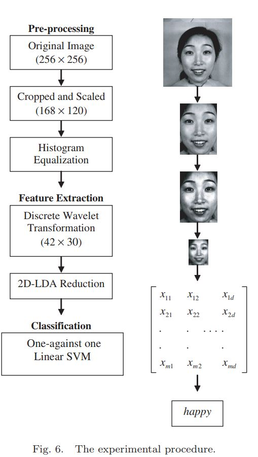
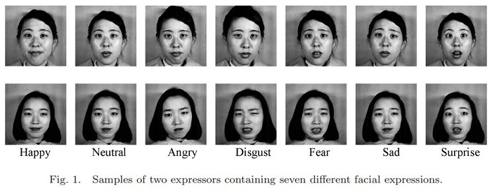
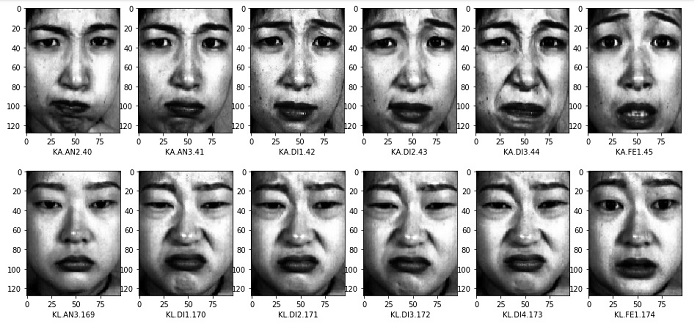

# Facial Expression Recognition In Jaffe Database

A Python implementation for the method described in the paper:
**Performance Comparisons of Facial Expression Recognition in Jaffe Database.**
https://www.researchgate.net/publication/220359507_Performance_Comparisons_of_Facial_Expression_Recognition_in_Jaffe_Database

### Pipeline

  - preprocessing
  - Feature extraction
  - Expression classification (SVM)

### Jaffe Database

Download the database from the following link:
http://www.kasrl.org/jaffe.html
The database contains ten Japanese females.
Seven different facial expressions (neutral, happy, angry, disgust, fear, sad, surprise)

### Preprocessing
This will include:
- Eyes detection
- rotate the face by the angle between eyes-axis and x-axis
- crop the face (as descriped in the paper)
- resize the copped face to (96,128)
- Equalize Hist

### Installation
`pip install PyWavelets`
`pip install dlib`
`pip install opencv-python`
`pip install imutils`

in addition to numpy, sklearn and matplotlib